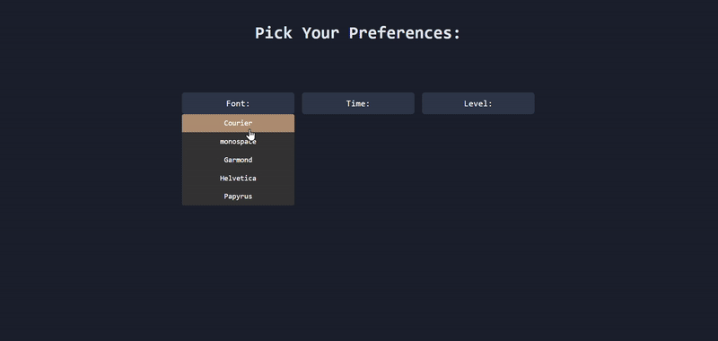
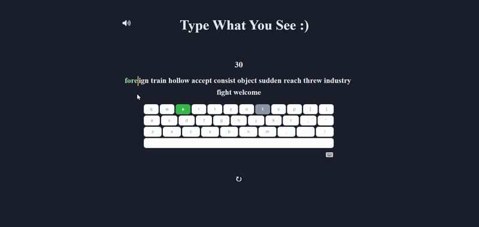
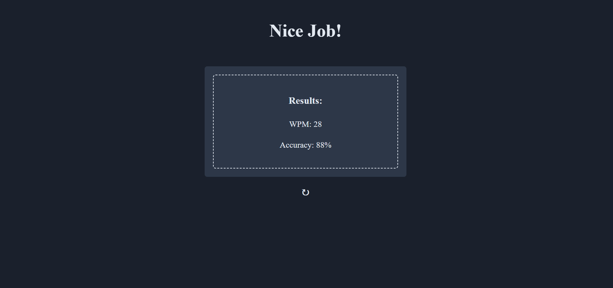

# Typing Practice App
This is a web application designed to help users improve their typing speed and accuracy. It offers a customizable practice environment where users can select various options to tailor their typing experience.

## Overview
The typing practice app provides an interactive platform for users to enhance their typing skills. It features a clean interface and real-time feedback, making the learning process engaging and effective.

This project was built primarily as a learning exercise for React. I wanted a project that was interactive, UI-driven, and fun to use. I also wanted a typing practice app that felt simpler and more focused than existing tools found online, which offer a lot of configuration and features, sometimes to an overwhelming extent.


## Features
* Customizable Practice Settings: Users can choose their preferred font, practice duration, and difficulty level to suit their individual needs.
* Real-time Feedback: As users type, the application provides instant visual cues on the typed text, highlighting correct and incorrect characters.
* Dynamic Keyboard Map: An optional, interactive keyboard map assists with blind typing by visually indicating the next key to press and highlighting keys as they are typed (showing correct/incorrect presses).
* Typing Audio Toggle: Users can enable or disable typing sound effects for an immersive experience.
* Performance Metrics: Upon completion of a practice session, users are presented with their Words Per Minute (WPM) and accuracy scores.

## Tech Stack
* React
* JavaScript
* CSS
* Vite
* Docker
* nginx

## Running the App
The application is containerized and can be run locally using Docker. Docker should be installed. Use the following to build and run the app:

```
npm run docker:start
```

The app will be available at: http://localhost:8080

To stop and clean up, use the following:

```
npm run docker:clean
```

## Demo
Here's a quick look at the app in action:

<div style="display: flex; justify-content: center; flex-wrap: wrap; gap: 20px">
    
    
    
</div>


